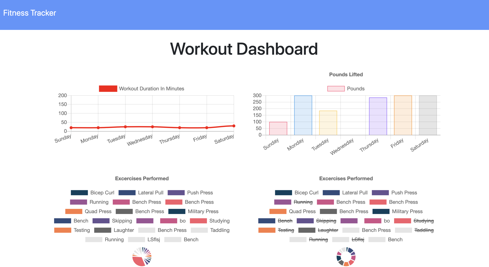

# Workout Tracker READ ME
        
## Summary
An application that allows users to view, track and create daily workouts. A user can log multiple exercises within a workout in a day and can log name, type, weights, sets, reps, and duration. For cardio exercises, distance is tracked. 

## Site Picture



## Table of Contents

- [Technologies Used](#Technologies-Used)
- [Learning Points](#Learning-Points)
- [Use](#Use)
- [Installation](#Installation)
- [Usage](#Usage)
- [Acknowledgements](#Acknoledgements)
- [Author](#Author)

## Technologies Used

- Mongo - used to store and retrieve data
- Mongoose - used to make db calls to Mongo
- HTML and CSS - used to create a good looking game
- Git - version control system for tracking changes to code
- Github - to host the repository and website

## Learning Points
- How to use Mongo in a more meaninful way. There was a lot of troubleshooting using Stack Overflow.
- Working with a code base that's half built is much more challenging since the code logic used may not be in line with what you would have done.
- Drafting how I thought the system worked before even diving in helped me understand the assignment and gave me a map for navigating the code.


## Dependencies
```
express
mongoose
path
require

```
## Installation
```
npm install express
npm install mongoose
npm install path
npm install require
```

## Code Snippet
Since multiple exercises exist within each Workout, whenever an exercise was added to a workout, it was necessary to do a find and update rather than a create function. 

```
app.put("/api/workouts/:id", (req, res) => {
    db.Workout.findOneAndUpdate(
      { _id: req.params.id }, 
      {$push: { exercises: req.body }} ,
      { new: true }
      ).then(result => {
        console.log(result)
        res.json(result)
      }).catch(err => {
        res.json(err)
      });
  });
```


## Author
[GitHub](https://github.com/analoo)

